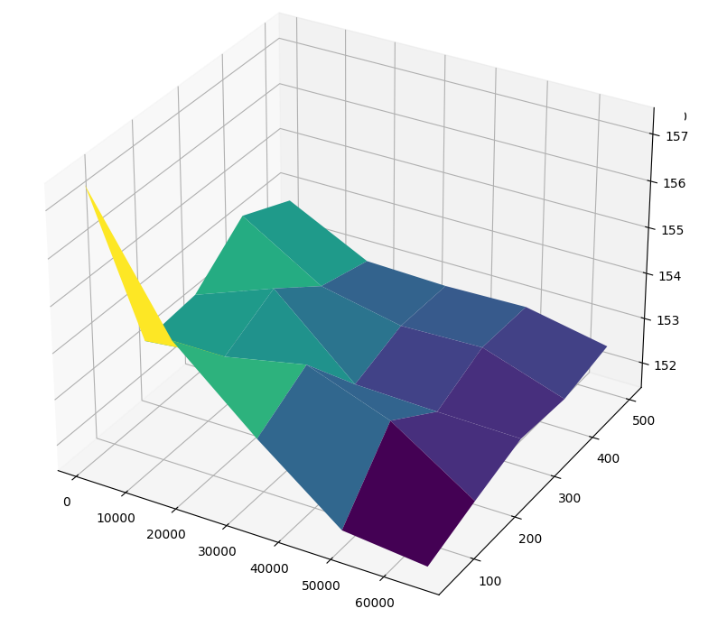
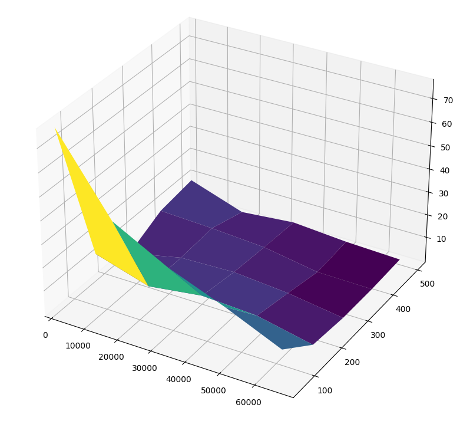
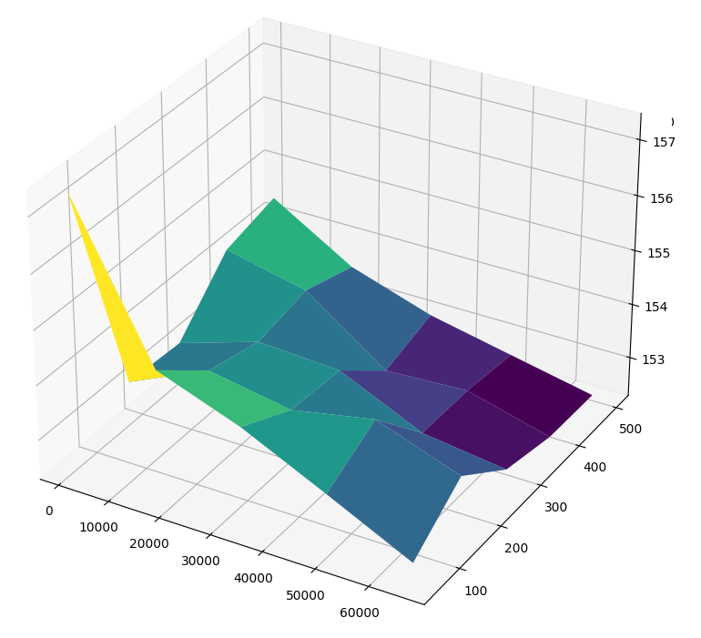

# Error injection testing

## err_injector_0

*Very slow adding errors to the array*

## err_injector_1

### Standard deviation

<table border="1" class="dataframe">
  <thead>
    <tr style="text-align: right;">
      <th></th>
      <th>50</th>
      <th>162</th>
      <th>275</th>
      <th>387</th>
      <th>500</th>
    </tr>
  </thead>
  <tbody>
    <tr>
      <th>1024</th>
      <td>157.432135</td>
      <td>154.697783</td>
      <td>153.151964</td>
      <td>151.753579</td>
      <td>151.564878</td>
    </tr>
    <tr>
      <th>17152</th>
      <td>153.246624</td>
      <td>153.435516</td>
      <td>153.797347</td>
      <td>153.137515</td>
      <td>151.963207</td>
    </tr>
    <tr>
      <th>33280</th>
      <td>153.359312</td>
      <td>154.014408</td>
      <td>152.427328</td>
      <td>152.368481</td>
      <td>152.331064</td>
    </tr>
    <tr>
      <th>49408</th>
      <td>154.253931</td>
      <td>153.183095</td>
      <td>152.811380</td>
      <td>152.858164</td>
      <td>152.250545</td>
    </tr>
    <tr>
      <th>65536</th>
      <td>153.751239</td>
      <td>152.865369</td>
      <td>152.807251</td>
      <td>152.848296</td>
      <td>152.487990</td>
    </tr>
  </tbody>
</table>

### Time, s

<table border="1" class="dataframe">
  <thead>
    <tr style="text-align: right;">
      <th></th>
      <th>50</th>
      <th>162</th>
      <th>275</th>
      <th>387</th>
      <th>500</th>
    </tr>
  </thead>
  <tbody>
    <tr>
      <th>1024</th>
      <td>4.144717</td>
      <td>4.505900</td>
      <td>4.530002</td>
      <td>4.687013</td>
      <td>4.875728</td>
    </tr>
    <tr>
      <th>17152</th>
      <td>14.106234</td>
      <td>17.830188</td>
      <td>21.989044</td>
      <td>25.663157</td>
      <td>29.762873</td>
    </tr>
    <tr>
      <th>33280</th>
      <td>24.203912</td>
      <td>31.991236</td>
      <td>40.528676</td>
      <td>48.568599</td>
      <td>54.254129</td>
    </tr>
    <tr>
      <th>49408</th>
      <td>34.554913</td>
      <td>45.438098</td>
      <td>56.704615</td>
      <td>67.371262</td>
      <td>78.393369</td>
    </tr>
    <tr>
      <th>65536</th>
      <td>44.373808</td>
      <td>62.051166</td>
      <td>77.384939</td>
      <td>88.498642</td>
      <td>103.149559</td>
    </tr>
  </tbody>
</table>

## err_injector_2

### Standard deviation

<table border="1" class="dataframe">
  <thead>
    <tr style="text-align: right;">
      <th></th>
      <th>50</th>
      <th>162</th>
      <th>275</th>
      <th>387</th>
      <th>500</th>
    </tr>
  </thead>
  <tbody>
    <tr>
      <th>1024</th>
      <td>77.356326</td>
      <td>45.361657</td>
      <td>33.011464</td>
      <td>23.892458</td>
      <td>13.543287</td>
    </tr>
    <tr>
      <th>17152</th>
      <td>12.305700</td>
      <td>5.235978</td>
      <td>8.448297</td>
      <td>7.202962</td>
      <td>2.216332</td>
    </tr>
    <tr>
      <th>33280</th>
      <td>0.223931</td>
      <td>5.334794</td>
      <td>6.114870</td>
      <td>4.132038</td>
      <td>0.683277</td>
    </tr>
    <tr>
      <th>49408</th>
      <td>7.476136</td>
      <td>6.438594</td>
      <td>4.878823</td>
      <td>0.904073</td>
      <td>0.564649</td>
    </tr>
    <tr>
      <th>65536</th>
      <td>9.741046</td>
      <td>1.851789</td>
      <td>3.955836</td>
      <td>2.141928</td>
      <td>1.203338</td>
    </tr>
  </tbody>
</table>

### Time, s

<table border="1" class="dataframe">
  <thead>
    <tr style="text-align: right;">
      <th></th>
      <th>50</th>
      <th>162</th>
      <th>275</th>
      <th>387</th>
      <th>500</th>
    </tr>
  </thead>
  <tbody>
    <tr>
      <th>1024</th>
      <td>4.513503</td>
      <td>5.660892</td>
      <td>6.813912</td>
      <td>7.978444</td>
      <td>9.257352</td>
    </tr>
    <tr>
      <th>17152</th>
      <td>21.359522</td>
      <td>41.224964</td>
      <td>60.541501</td>
      <td>80.024357</td>
      <td>100.511184</td>
    </tr>
    <tr>
      <th>33280</th>
      <td>37.922621</td>
      <td>75.760242</td>
      <td>113.554837</td>
      <td>150.799073</td>
      <td>187.044439</td>
    </tr>
    <tr>
      <th>49408</th>
      <td>54.148592</td>
      <td>110.269970</td>
      <td>165.736959</td>
      <td>218.249763</td>
      <td>271.866799</td>
    </tr>
    <tr>
      <th>65536</th>
      <td>70.781804</td>
      <td>144.041590</td>
      <td>217.000616</td>
      <td>290.232929</td>
      <td>360.795952</td>
    </tr>
  </tbody>
</table>

## err_injector_3

### Standard deviation

<table border="1" class="dataframe">
  <thead>
    <tr style="text-align: right;">
      <th></th>
      <th>50</th>
      <th>162</th>
      <th>275</th>
      <th>387</th>
      <th>500</th>
    </tr>
  </thead>
  <tbody>
    <tr>
      <th>1024</th>
      <td>157.365397</td>
      <td>154.648407</td>
      <td>154.093632</td>
      <td>153.368424</td>
      <td>152.623110</td>
    </tr>
    <tr>
      <th>17152</th>
      <td>153.187307</td>
      <td>153.856377</td>
      <td>153.595404</td>
      <td>153.890560</td>
      <td>153.340895</td>
    </tr>
    <tr>
      <th>33280</th>
      <td>153.129440</td>
      <td>153.602072</td>
      <td>153.521330</td>
      <td>152.819268</td>
      <td>152.617980</td>
    </tr>
    <tr>
      <th>49408</th>
      <td>154.149724</td>
      <td>153.807432</td>
      <td>152.731941</td>
      <td>152.808405</td>
      <td>152.403994</td>
    </tr>
    <tr>
      <th>65536</th>
      <td>154.407718</td>
      <td>153.506992</td>
      <td>153.012468</td>
      <td>152.694707</td>
      <td>152.381406</td>
    </tr>
  </tbody>
</table>

### Time, s

<table border="1" class="dataframe">
  <thead>
    <tr style="text-align: right;">
      <th></th>
      <th>50</th>
      <th>162</th>
      <th>275</th>
      <th>387</th>
      <th>500</th>
    </tr>
  </thead>
  <tbody>
    <tr>
      <th>1024</th>
      <td>4.615969</td>
      <td>4.040953</td>
      <td>4.213001</td>
      <td>4.457991</td>
      <td>4.508763</td>
    </tr>
    <tr>
      <th>17152</th>
      <td>13.411816</td>
      <td>15.324738</td>
      <td>22.731240</td>
      <td>20.091081</td>
      <td>21.196513</td>
    </tr>
    <tr>
      <th>33280</th>
      <td>22.154310</td>
      <td>25.949366</td>
      <td>29.807723</td>
      <td>33.426961</td>
      <td>37.321273</td>
    </tr>
    <tr>
      <th>49408</th>
      <td>30.877888</td>
      <td>36.778358</td>
      <td>42.546814</td>
      <td>48.346741</td>
      <td>59.562714</td>
    </tr>
    <tr>
      <th>65536</th>
      <td>44.706303</td>
      <td>50.407019</td>
      <td>58.189291</td>
      <td>66.026998</td>
      <td>71.163811</td>
    </tr>
  </tbody>
</table>
